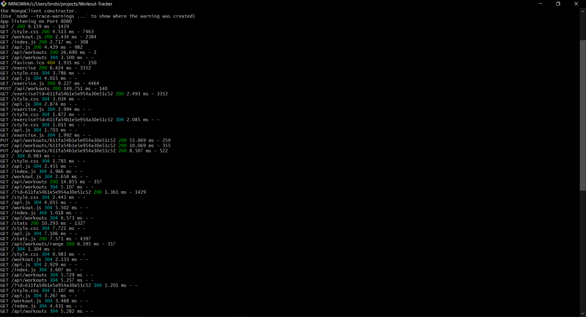

# Workout-Tracker

## Description

An application that allows the user to view, create, and track daily workouts.

The user can track these workouts by the name, type, weight, set, reps, and duration. For cardio excercises, the user can track distance traveled.

  ## Table of Contents
  
  * [Installation](#installation)
  
  * [Usage](#usage)
  
  * [License](#license)

  * [Tests](#tests)
  
  * [Questions](#questions)
  
  ## Installation
  
  To install necessary dependencies, run the following command: "npm i".

  To seed the database, run the command "npm run seed"

  To run the server in the CLI: "npm start".
  
  
  ## Usage

Screenshots of the Application

  

  

  

Screenshot of the working routes in the CLI

  

  

  ## License
    
    This application is licensed under the MIT license.
    

  ## Tests
  
  There are no tests for this application.
  
      
  ## Questions  

  If you have any questions about the repo or application, open an issue or contact me directly at sample. More of my work can be found at [My Github](https://github.com/brob92993).

  [Workout Tracker Repository](https://github.com/brob92993/Workout-Tracker.git)

  
  [Deployed Heroku Application](https://blooming-savannah-11062.herokuapp.com/)